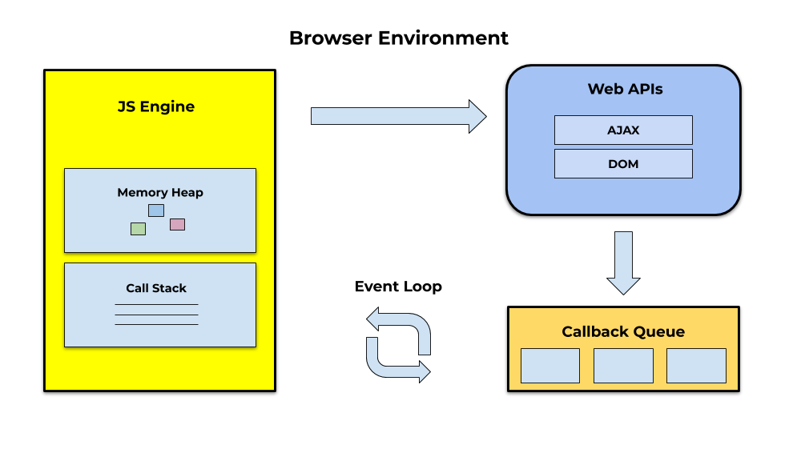

<!-- # Exam: Modern Web Development -->

> The exam consists of 7 parts. You can answer in **Finnish** or in **English**

<!-- ## Notes
- The exam is meant to differentiate those who get 5 from the rest
- Since the exam is online, I will have a brief discussion (10-15min) with those who get Grade 5 or Grade 4 (It is not an oral exam)
- You can answer in Finnish or in English
- Please do not stress yourself if you are not able to answer all questions
- The Exam is worth 100 points
- The exam consists of 5 parts
- You are allowed to use vscode

> Good luck! -->

- [Part 1: Soft Skills (10 points)](#part-1-soft-skills-10-points)
- [Part 2: Background (20 points)](#part-2-background-20-points)
- [Part 3: Basic Server - Node/Express (10 points)](#part-3-basic-server---nodeexpress-10-points)
- [Part 4: Basic ReactJS (15 points)](#part-4-front-end-reactjs-15-points)
- [Part 5: Advanced Server (10 points)](#part-5-advanced-server-10-points)
- [Part 6: Advanced React (20 points)](#part-6-advanced-react-20-points)
- [Part 7: Data persistence - MongoDB/Mongoose (15 points)](#part-7-data-persistence---mongodbmongoose-15-points)

## Part 1: Soft Skills (10 points)

1. Discuss the importance of collaboration and communication in the 21st century work environment.
2. State some character trait you possess that help your career.
3. How can you keep up with with technology trends? is it easy to stay up-to-date with new technologies?
<!-- 6. How important is stress management? how would you manage stress? -->

## Part 2: Background (20 points)

1. WHat is the difference between JSON and JavaScript Objects?
2. Is there a difference between building an app that runs in the browser and a Node.js application?
3. What are CRUD operations? How does each letter in the acronym CRUD map to HTTP actions?
4. What are promises? Compare promises with callbacks.
5. What is modern JavaScript?
6. Discuss the process of developing and deploying a full-stack application to the cloud.
7. How does the Event Loop work? How is it related to asynchronous JavaScript. Refer to the following figure:
   

## Part 3: Basic Server - Node/Express (10 points)

You will create a new Express project and initialize an application to listen for requests on a port. You will also return a simple
text response on the `/status` route.

- **Step 1**:

create a directory called **server** and `cd` into it.

Add a `package.json` file by running the following command:

```shell
npm init -y
```

Install the following dependencies using the command `npm install express`

Install the following development dependencies using the command
`npm install -D nodemon`

- **Step 2**:

Create a file called **app.js** inside of your **server** folder.

Initialize an Express application inside that file:

```js
const express = require('express')

// Create the Express app.
const app = express()
```

- **Step 3**: Establish listener

Create a `port` variable and set it to a desired port for your Express
application like `3001`:

```js
const port = 3001
```

Allow the initialized Express application to listen for requests at the port
you set to the `port` variable. Your application should log something like
`"Server is listening on port <port number>"` when the server successfully
connects to the port:

```js
app.listen(port, () => console.log(`Listening on port ${port}...`))
```

- **Step 4**: Add scripts to start the server

Create a script in the **package.json** file to start the server in production using `node`. The script can be named "start".

Create another script to start the server in development using the `nodemon`
package. `nodemon` allows the server to automatically restart whenever any
server files get updated. This script can be called "dev".

- **Step 5**: Test your server

Start your server in development using one of the _package.json_ scripts.

Check to see if you set things up correctly by navigating to the appropriate
URL for accessing the root URL for the Express server in the browser.

You should see the generic Express error message of `Cannot GET /` because you have not created a route handler for `GET /` yet.

- **Step 6**: Make route with text response

Create a route handler for the GET protocol at the route `/status`. Send a plain text response using `res.send()` with text like "The server is alive!".

```js
app.get('/status', function (req, res) {
  res.send('The server is alive')
})
```

Test your new route in the browser by adding `/status` after the port number in the address bar.

If all is working properly, your browser will show

```plaintext
The server is alive!
```

## Part 4: Front end: ReactJS (15 points)

1. Compare code 1 and code 2 below. Which one do you prefer? When do we need to use keys?

- Code 1:

```js
const ids = [1, 2, 3, 4, 5]
const listElements = ids.map((id) => {
  return <li key={id}>{id}</li>
})
```

- Code 2:

```js
const ids = [1, 2, 3, 4, 5]
const listElements = ids.map((id) => {
  return <li key={id.toString()}>{id}</li>
})
```

2. Given the animals array below:

```js
let animals = ['cat', 'chicken', 'cow']
```

Use the map function to render the elements as follows:

```html
<ul>
  <li>cat</li>
  <li>chicken</li>
  <li>cow</li>
</ul>
```

3. What's wrong with the following code?

```
export default function Person() {
  return
  
}
```

4. In the example below:

- Simplify the component by using destructuring.
- Why are we using the useEffect() Hook?

```js
import { useEffect } from 'react';

function Welcome(props.name) {
 const msg = `Hi, ${props.name}!`;

 useEffect(() => {
   document.title = `Welcome ${props.name}`;
 }, [props.name]);

 return <div>{msg}</div>;
}
```

5. Display the title of each recipe in the array and and list its ingredients.

```js
const recipes = [
  {
    id: 'salad',
    name: 'Greek Salad',
    ingredients: ['tomatoes', 'cucumber', 'onion', 'olives', 'feta'],
  },
  {
    id: 'pizza',
    name: 'Pizza',
    ingredients: [
      'pizza crust',
      'pizza sauce',
      'mozzarella',
      'ham',
      'pineapple',
    ],
  },
  {
    id: 'hummus',
    name: 'Hummus',
    ingredients: ['chickpeas', 'olive oil', 'garlic cloves', 'lemon', 'tahini'],
  },
]

export default function App() {
  return (
    <div>
      <h1>Recipes</h1>
      {recipes
        .map
        // Your code here
        ()}
    </div>
  )
}
```

3. Explain how the following component works.

```js
import { useState } from 'react'

function filterItems(items, query) {
  query = query.toLowerCase()
  return items.filter((item) =>
    item.name.split(' ').some((word) => word.toLowerCase().startsWith(query))
  )
}

const foods = [
  {
    id: 0,
    name: 'Sushi',
    description: 'Sushi is a traditional Japanese dish',
  },
  {
    id: 1,
    name: 'Dal',
    description:
      'dal is a form of a soup to which onions, tomatoes and various spices may be added',
  },
  {
    id: 2,
    name: 'kebab',
    description: 'kebab is a popular meal of grilled cubes of meat.',
  },
]

export default function App() {
  const [query, setQuery] = useState('')
  const results = filterItems(foods, query)

  function handleChange(e) {
    setQuery(e.target.value)
  }

  return (
    <>
      <SearchBar query={query} onChange={handleChange} />
      <hr />
      <List items={results} />
    </>
  )
}

function SearchBar({ query, onChange }) {
  return (
    <label>
      Search: <input value={query} onChange={onChange} />
    </label>
  )
}

function List({ items }) {
  return (
    <table>
      <tbody>
        {items.map((food) => (
          <tr key={food.id}>
            <td>{food.name}</td>
            <td>{food.description}</td>
          </tr>
        ))}
      </tbody>
    </table>
  )
}
```

## Part 5: Advanced Server (10 points)

Make an anecdotes server. The server must have at least these two "routes":

- `/anecdotes` - returns ALL of the anecdotes, as JSON.
- `/anecdotes/random` - returns ONE of the anecdotes, picked differently at random each time it is requested.

A list of quotes (in JSON format) is provided in [anecdotes.json](./src/part5/anecdotes.json). Each quote is a simple object with a quote and an author.

Here are some steps to guide you:

### Step1

Add a `/anecdotes` route to return _all_ of the anecdotes as JSON.

Note that the anecdotes have already been loaded for you from a JSON file in [server.js](<(./src/part5/server.js)>).

Test that your server successfully serves all of the quotes as json by making a request for /anecdotes from your new server.

> To add a new route, you can copy-paste an existing route and change its parameters.

For example, here are two routes

```js
app.get('/one', function (request, response) {
  response.send('You asked for route /one')
})

app.get('/two', function (request, response) {
  response.send('You asked for route /two')
})
```

<!-- You can refer to this short [Basic Routing](https://expressjs.com/en/starter/basic-routing.html) document for discussion on what each part does. -->

### Step2

Add a `/anecdotes/random` route to return _ONE_ of the anecdotes, picked randomly on each request.

You are provided with a function `pickFromArray`, to pick randomly from an array .

Feel free to write your own function which returns one element at random from any given array, and use that!

Test that this route is working too by making a request to `/anecdotes/random` You should get one an object with an anecdote and an author.

Make sure that the previous routes `/anecdotes` and `/` are still working, too!

### Step 3

In the real world, many developers would use a library like [lodash](https://lodash.com/) to make it simpler to do tasks like picking randomly from an array.

In this step challenge, you should install and use lodash to do the picking.

[Here's the documentation for its sample() function](https://lodash.com/docs/4.17.11#sample).

- Install the lodash library:
- Add a "require" line in your server.js so that you can use the library.

`const lodash = require('lodash');`

then you can use...

`lodash.sample(myArray)`

## Part 6: Advanced React (20 points)

### step1

Expand the following application by adding a button that can be clicked to display a **random** anecdote.

You can find out how to generate random numbers in JavaScript, eg. on [Mozilla Developer Network](https://developer.mozilla.org).

```js
import { useState } from 'react'

const App = () => {
  const anecdotes = [
    'Genius is one percent inspiration and ninety-nine percent perspiration.',
    'You can observe a lot just by watching.',
    'A house divided against itself cannot stand.',
    'Difficulties increase the nearer we get to the goal.',
    'Nothing happens unless first we dream.',
    'Life is a learning experience, only if you learn.',
    'Today is the tomorrow we worried about yesterday.',
  ]

  const [selected, setSelected] = useState(0)

  return <div>{anecdotes[selected]}</div>
}

export default App
```

Content of the file **index.js** is as follows:

```js
import React from 'react'
import ReactDOM from 'react-dom/client'

import App from './App'

ReactDOM.createRoot(document.getElementById('root')).render(<App />)
```

### step2

Expand your application so that you can vote for the displayed anecdote.

**NB** store the votes of each anecdote into an array or object in the component's state. Remember that the correct way of updating state stored in complex data structures like objects and arrays is to make a copy of the state.

You can create a copy of an object like this:

```js
const points = { 0: 1, 1: 3, 2: 4, 3: 2 }

const copy = { ...points }
// increment the property 2 value by one
copy[2] += 1
```

OR a copy of an array like this:

```js
const points = [1, 4, 6, 3]

const copy = [...points]
// increment the value in position 2 by one
copy[2] += 1
```

Using an array might be the simpler choice in this case. Searching the Internet will provide you with lots of hints on how to [create a zero-filled array of a desired length](https://stackoverflow.com/questions/20222501/how-to-create-a-zero-filled-javascript-array-of-arbitrary-length/22209781).

### step3

Now modify the application to display the anecdote with the largest number of votes:

If multiple anecdotes are tied for first place it is sufficient to just show one of them.

### step4

The API [https://type.fit/api/quotes](https://type.fit/api/quotes) provides quotes in **JSON** format.
Modify the application, to fetch the data from this [endpoint](https://type.fit/api/quotes).

### step5

- Modify the application, to fetch the data from the server you created earlier in part 3. You'll have to enable CORS on the express app.
- Host your react app on Github pages.
- submit the URL of your hosted React app.

## Part 7: Data persistence - MongoDB/Mongoose (15 points)

Inside the `/src/part7` folder run the following command:

```shell
npm install
```

- Step 1: Recipe Schema

Create a `Recipe` model inside of the file `/src/part7/models/Recipe.model.js`. The schema should have the following fields:

- **title** - Type `String`. It should be required and unique.
- **level** - Type `String`. Can be one of the following values: _Easy Peasy_ - _Amateur Chef_ - _UltraPro Chef_ (remember the `enum` validator :wink:).
- **ingredients** - Type `Array` of `String`s (represented as `[ String ]`).
- **cuisine** - Type `String`. Should be required.
- **dishType** - Type `String`. Possible values: _breakfast_, _main_course_, _soup_, _snack_, _drink_, _dessert_ or _other_.
- **image** - Type `String`. Default value: _"https://images.media-allrecipes.com/images/75131.jpg"_.
- **duration** - Type `Number`. The minimum value should be 0.
- **creator** - Type `String`.
- **created** - Type `Date`. By default, today.

- Step 2: Create a recipe

In the `index.js`, we first connect to the database using `mongoose.connect()` and following the connection we call the method `Recipe.deleteMany()` to remove any existing documents from the recipes collection:

```js
// ...

mongoose.connect(MONGODB_URI).then((x) => {
  console.log(`Connected to the database: "${x.connection.name}"`)
  // Before adding any recipes to the database, let's remove all existing ones
  return Recipe.deleteMany()
})
// ...
```

Then, you should add a new recipe document to the database by calling the [`Model.create`](https://mongoosejs.com/docs/api.html#model_Model.create) method and passing it the recipe details as an object. After inserting the recipe, you should `console.log` the `title` of the recipe.

**To run your code, remember you should use:**

```shell
node index.js
```

- Step 3: Insert multiple recipes

We are importing an array of recipes from the `data.json` file. Using the [`Model.insertMany`](https://mongoosejs.com/docs/api.html#model_Model.insertMany) method, you should add the entire array to the database. After inserting the documents, print the title of each recipe to the console.

Tip: Follow the same tip as in the previous step.

- Step 4: Update recipe

Now you should have six different recipes in the database, but there was a mistake in one of them. The **Rigatoni alla Genovese** does not take that long. You should update the `duration` field and set it to **100**. You might want to use the [`Model.findOneAndUpdate`](https://mongoosejs.com/docs/api.html#model_Model.findOneAndUpdate) method. After updating it, print a success message!

- Step 5: Remove a recipe

The `Carrot Cake` is no longer available, so we need to remove it from the database. Using the [`Model.deleteOne`](https://mongoosejs.com/docs/api.html#model_Model.deleteOne) method, remove that recipe from the database and display a success message after doing it!

> You need to close the database. Otherwise, the connection will stay open until the Node.js process dies. Pay attention to the asynchronicity of the operation. You should only close the connection after everything is done!
